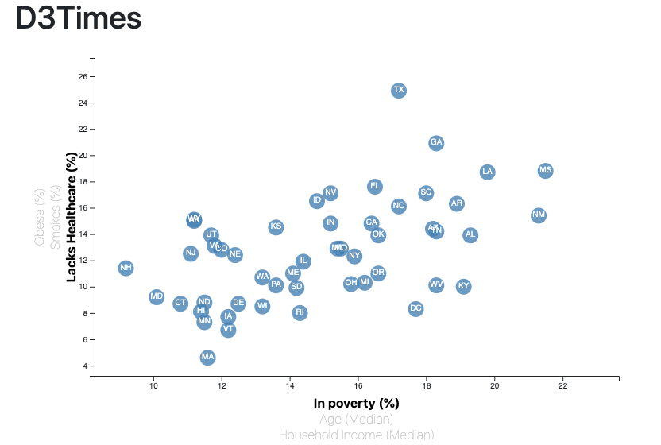

# Data Journalism and D3

The data set in this project is based on 2014 ACS 1-year estimates from the [US Census Bureau](https://data.census.gov/cedsci/). The current data set includes data on rates of income, obesity, poverty, etc. by state.

### Project Details

Completed both main and bonus assignments using JS (D3), CSS. Project structure consist of "Index.html" file and "static" folder with all related files/folders inside of the the root directory.

In order to preview dashboard scatter plot visualization locally navigate tp the root directory in Terminal window and run Python HTTP server simulation - "python -m http.server" command. Open Google (or other) browser and go to http://localhost:8000/.

Visualization is interactive by clicking on desired X or Y data labels, navigating mouse over a circles will popup with selected data points.

Published GitHub version is accessible via following link [GitHub Link](https://ipavlunin.github.io/D3-Challenge/)

- - -

